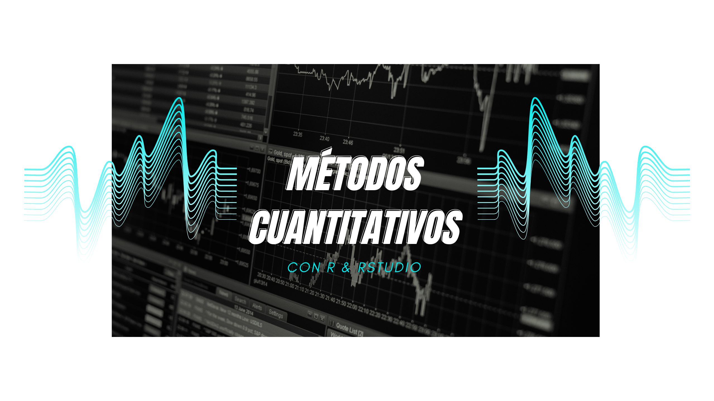

  Bienvenidxs al curso de Métodos Cuantitativos II de la carrera de Antropología en la Universidad Alberto Hurtado.

### Equipo Académico

| Profesores               |email  | 
|-----------------------|-------|
| Sebastián Muñoz       |  sebastianmunozt@gmail.com|
| Gino Ocampo           |  ginowrs@gmail.com|

| Ayudantes             | email |
|-----------------------|------|
| Matías Álvarez       | maalvarr@alumnos.uahurtado.cl|
| Francesca Rocco     | franroco21@gmail.com|

A continuación, podrán descargar el programa y programación del curso.

Programa: [`[Programa]`](https://ginowrs.github.io/mc2/files/programa_2024.pdf) 

Programación: [`[Programación]`](https://ginowrs.github.io/mc2/files/programacion_2024.pdf) 

---
## Calendario

Nota: Todas las clases son presenciales, a continuación pueden ver las presentaciones de las clases.

| Fecha             | Contenido                                                      | Material                                                                                                                                                  |
|-------------------|---------------------------------------------------------------|----------------------------------------------------------------------------------------------------------------------------------------------------------|
| vier mar 15       | Introducción a R base y Rstudio                               | [`[Clase1]`](https://metodoscuantitativos.github.io/mc2/clases/clase_01/clase_1#1)   [`[.R]`](clases/clase_01/clase_1.R)                                    |
| vier mar 22        | Cuestionarios y `tidyverse`                             |  [`[Clase2]`](https://metodoscuantitativos.github.io/mc2/clases/clase_02/Clase_2#1) [`[.R]`](clases/clase_02/clase_2.R)                                       |
| vier abril 5         | Introducción muestreo y Excel                                 | [`[clases]`](https://metodoscuantitativos.github.io/mc2/clases/clase_03/clase_3#1) [`[.Rmd]`](clases/class_2/class_2.Rmd)                                                                                                                                                         |
| vier abril 12         | Data Wrangling                                 |  [`[.R]`](clases/class_2/class_2.R)                                                                                                                                                         |
| vier abril 19        | **Evaluación individual I**: nivelación en R                                                      | [`[workflow.zip]`](clases/class_4/workflow.zip)                                                                                                                                                       |
| vier abril 26       | Análisis de datos categóricos                                                    |  [`[workflow_ta.zip]`](clases/class_4/workflow_ta.zip)                                                                                                                                                              |
| vier mayo 03        | Ejercicios en clase en R: procesamiento y análisis de datos categóricos            |  [`[clases]`](https://mebucca.github.io/dar_soc4001/clases/class_5/class_5#1) [`[.Rmd]`](clases/class_5/class_5.Rmd)                                                                                                                                                        |
| vier mayo 10        | Visualización de datos categóricos en `ggplot`            |  [`[.R]`](clases/class_5/class_5.R)                                                                                                                                                              |
| vier mayo 17       |  Análisis de datos cuantitativos           |     [`[clases]`](https://mebucca.github.io/dar_soc4001/clases/class_6/class_6#1) [`[.Rmd]`](clases/class_6/class_6.Rmd)                                                                                                                                                                                                        |
| vier mayo 31         | Prueba de hipótesis: T de Student y ANOVA            |   [`[.R]`](clases/class_6/class_6.R)                                                                                                                                                          |
| vier jun 07        | Correlación y regresión |          [`[clases]`](https://mebucca.github.io/dar_soc4001/clases/class_7/class_7#1) [`[.Rmd]`](clases/class_7/class_7.Rmd)                                                                                                                                                 |
| vier jun 14        | **Evaluación individual II**: Procesamiento y análisis de datos categóricos |            [`[.R]`](clases/class_7/class_7.R)                                                                                                                                                  |
| vier jun 28        | Pruebas recuperativas           |          [`[clases]`](https://mebucca.github.io/dar_soc4001/clases/class_9/class_9#1) [`[.Rmd]`](clases/class_9/class_9.Rmd)                                                                                                                                                |
| vier jul 05        | Tiempo para preparación y dudas           |   [`[.R]`](clases/class_9/class_9.R)                                                                                                                                                        |
| vier jul 12        | **Entrega Grupal Final** presentación de investigación en clases y entrega de trabajo                                   | [`[clases]`](https://mebucca.github.io/dar_soc4001/clases/class_10/class_10#1) [`[.Rmd]`](clases/class_10/class_10.Rmd)                                                                                                                                                         |

---
## Cápsulas

- Descargar e instalar `R`: [`[Cápsula]`](https://posit.co/download/rstudio-desktop/): 

---
## Evaluaciones 

| Evaluación     | Contenido   | Entrega       | Material |
|----------------|--------------|---------------|----------|
| Avance 1        | Presentación de formulario corregido | Abril 05 |  [`[Avance 1]`](homework/t_1_answers.pdf)        |
| Evaluación individual I        |  nivelación en R    | Abril 19    |  [`[Evaluación individual I ]`](https://mebucca.github.io/dar_soc4001/homework/t_2#1)            |
| Avance 2       | Procesamiento y análisis básico    | Mayo 10    |  [`[Avance 2]`](https://mebucca.github.io/dar_soc4001/homework/t_3#1)         | 
| Evaluación individual II       | Procesamiento y análisis de datos categóricos  | Junio 14  |  [`[Evaluación individual II ]`](https://mebucca.github.io/dar_soc4001/homework/t_4_answer#1)       |
| Entrega grupal final     |  Presentación de investigación en clases y entrega de trabajo | Julio 12  |           [`[T5]`](https://mebucca.github.io/dar_soc4001/homework/t_5#1)  | 

---
## Grupos de trabajo

Claro, aquí tienes la tabla con todas las celdas vacías:

| Nombre                 | Apellido(s)          | Grupo     |
|------------------------|----------------------|-----------|
|                        |                      |           |
|                        |                      |           |
|                        |                      |           |
|                        |                      |           |
|                        |                      |           |
|                        |                      |           |
|                        |                      |           |
|                        |                      |           |
|                        |                      |           |
|                        |                      |           |
|                        |                      |           |
|                        |                      |           |
|                        |                      |           |
|                        |                      |           |
|                        |                      |           |
|                        |                      |           |
|                        |                      |           |
|                        |                      |           |
|                        |                      |           |
|                        |                      |           |
|                        |                      |           |
|                        |                      |           |
|                        |                      |           |

#### Bibliografía del curso

- **R for Data Science** (Hadley Wickham & Garrett Grolemund) [`[e-Book]`](https://r4ds.had.co.nz/)

**Básica**

- Ritchey, Ferris (2001) Estadística para las ciencias sociales. El potencial de la imaginación estadística (México D.F.: McGraw-Hill/Interamericana Editores)

- Boccardo y Ruiz (2019) RStudio para Estadística Descriptiva en Ciencias Sociales

**Complementaria**

- Imai, K. (2018). Quantitative social science: an introduction. Princeton University Press.

- Madrigal L. Frontmatter. In: Statistics for Anthropology. Cambridge University Press; 2012:i-v. 

- Harvey, G. (2016). Excel 2016 for dummies. John Wiley & Sons

**Optativa**

- 01. Howard s. Becker - Datos, pruebas e ideas-Siglo XXI (2018)

- 02. Joel (2004) Uso y Abuson de Las Estadisticas

- 03. D'Ignazio y Klein (2020) Data Feminism-MIT Press
 
- 04. Sevilla (2005) Gramática de los gráficos

- 05. Sosa, Walter (2020) Big Data

- 07. AS Checklist for Articles_OSF

- Belcher Cómo-escribir-un-artículo-académico-en-12-semanas

